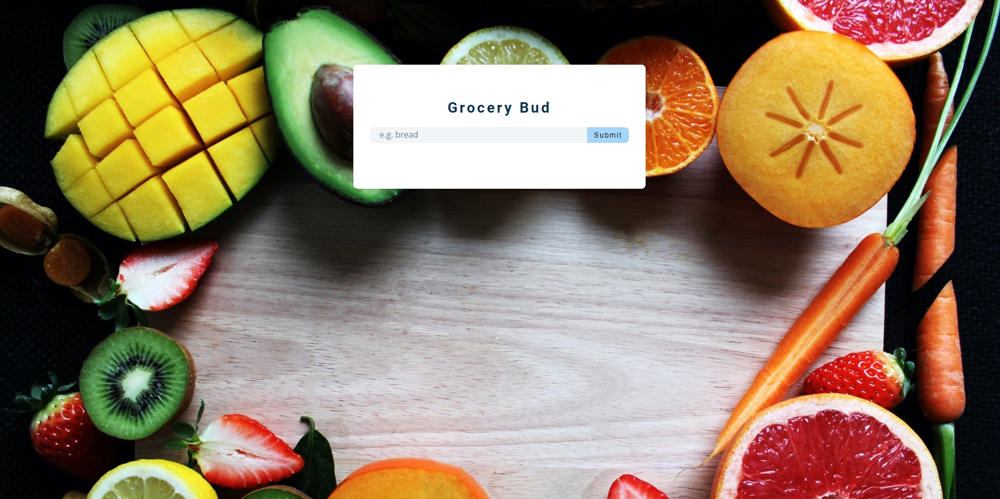
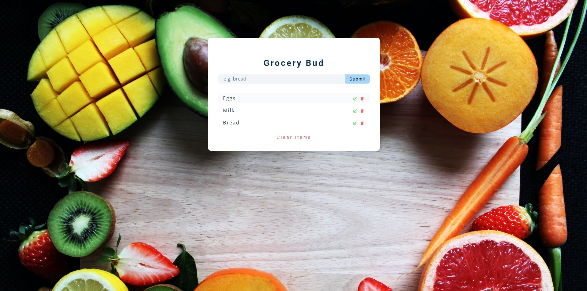

# Grocery Bud

Grocery Bud is a simple web application that allows users to create a grocery shopping list. Users can add, edit, and delete items from the list, making it convenient to keep track of their grocery needs.

**Features**

- Add items: Users can enter grocery items they need to buy.
- Edit items: Users can modify the name of existing items.
- Delete items: Users can remove items from the list.
- Clear all items: Users can clear the entire list at once.

 
  

**Languages**

**URL**

grocery-bud.pages.dev
